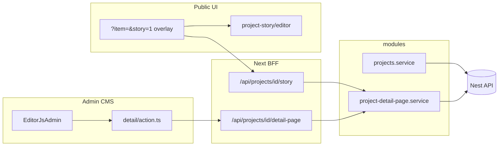
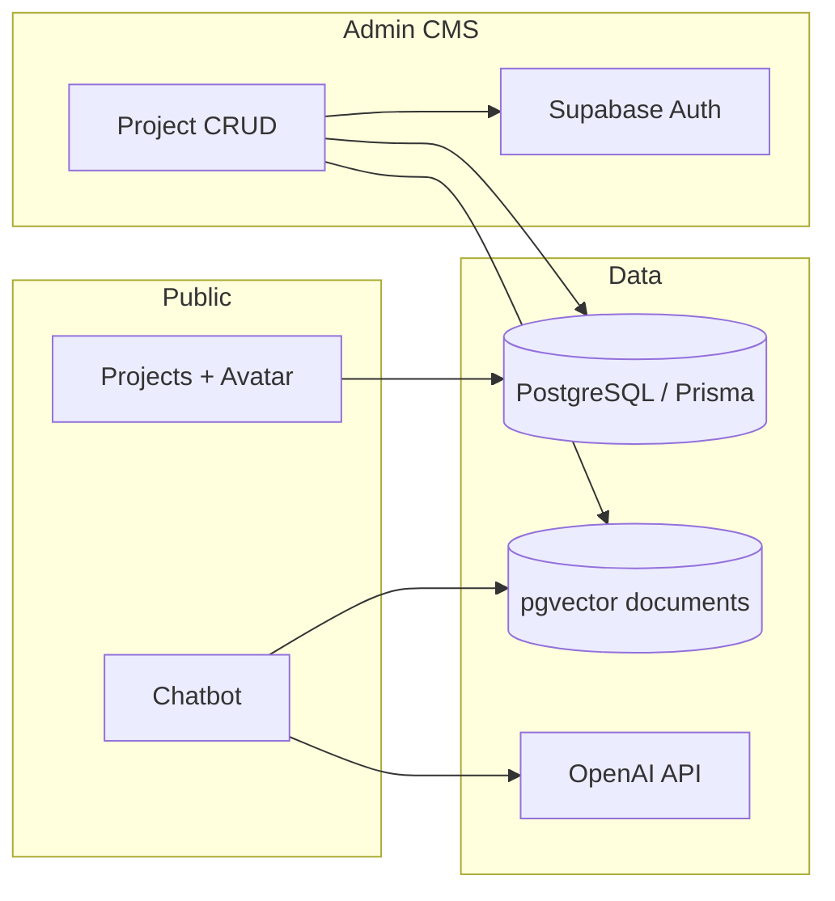

# Portfolio — Joonho Kim

Personal portfolio and CMS built with **Next.js 15 (App Router)**.  
Live site: [joonhokim.dev](https://www.joonhokim.dev)

<!--

-->


<p align="center">
  
</p>
<p align="center">
  <sub><i>Continuously optimizing UI/UX and dark/light themes.</i></sub>
</p>


> A production-ready multilingual portfolio built with the latest frontend ecosystem — **Next.js 15**, **React 19**, **Tailwind CSS 4**, **Prisma 7**, and **Storybook 10**.

## 🌟 Highlights

[🇺🇸 English](#-english) · [🇰🇷 한국어 요약](#-한국어-요약) · [🇯🇵 日本語要約](#-日本語要約)

### 🇺🇸 English

- **Multilingual public site** (ko / en / ja) with project list, 3D avatar, filters, and project detail drawer
- **Rich project stories** — Editor.js content with locale tabs in admin and a full-screen public overlay (`?item=&story=1`)
- **RAG chatbot** — OpenAI + pgvector (Supabase) retrieval over portfolio content, with FAQ flows and project deep-links
- **Private admin CMS** — Supabase Auth, Prisma/PostgreSQL, drag-and-drop ordering, image upload, Zod-validated server actions
- **Production-minded** — Sentry, GA4/GTM, CI (lint + unit + build), env-based secrets, chat API rate limiting

### 🇰🇷 한국어 요약

<details>
<summary><b>💡 핵심 하이라이트 보기 (클릭하여 펼치기)</b></summary>

- **다국어 지원 퍼블릭 사이트** (ko / en / ja): 프로젝트 목록·상세, 3D 아바타, 필터링 및 드로어(Drawer) 구현
- **상세 스토리**: 어드민 Editor.js 다국어 편집 + 퍼블릭 `?item=&story=1` 오버레이
- **RAG 기반 챗봇**: OpenAI API와 pgvector(Supabase)를 연동하여 포트폴리오 콘텐츠 내 문서 검색, FAQ 시나리오 및 프로젝트 딥링크 기능 지원
- **비공개 관리자 CMS**: Supabase Auth와 Prisma/PostgreSQL 기반의 CRUD, 드래그 앤 드롭 정렬, 이미지 업로드 및 Zod 스키마로 검증된 Server Actions 적용
- **프로덕션 지향 아키텍처**: Sentry 에러 트래킹, GA4/GTM 분석, GitHub Actions CI 파이프라인(Lint + Unit + Build), 환경 변수 기반 시크릿 관리, 챗봇 API 요청 제한(Rate Limiting) 반영

</details>

### 🇯🇵 日本語要約

<details>
<summary><b>💡 主なハイライトを表示 (クリックして展開)</b></summary>

- **多言語対応パブリックサイト** (ko / en / ja): プロジェクト一覧・詳細、3Dアバター、フィルタリング、詳細表示ドロワー（Drawer）機能を搭載
- **詳細ストーリー**: 管理画面の Editor.js 多言語編集と、公開サイトの `?item=&story=1` オーバーレイ
- **RAGベースのチャットボット**: OpenAI + pgvector (Supabase) を活用し、ポートフォリオ内のコンテンツに基づくドキュメント検索、FAQフロー、プロジェクトへのディープリンクをサポート
- **非公開の管理者用CMS**: Supabase Auth、Prisma/PostgreSQL、ドラッグ＆ドロップによる並び替え、画像アップロード、Zodによるバリデーションを経た Server Actions を実装
- **プロダクション環境を意識した設計**: Sentry によるエラー追跡、GA4/GTM 解析、CIパイプライン（Lint + Unit + Build）、環境変数によるシークレット管理、チャットAPIのレート制限（Rate Limiting）を適用

</details>

## Tech stack

[](https://nextjs.org/)
[](https://react.dev/)
[](https://www.typescriptlang.org/)
[](https://tailwindcss.com/)
[](https://www.prisma.io/)
[](https://storybook.js.org/)

| Layer | Choices |
| ----- | ------- |
| **Framework** | ⚡ **Next.js 15** · **React 19** · **TypeScript 5** |
| **Styling** | 🎨 **Tailwind CSS 4** · Framer Motion · next-themes |
| **i18n** | 🌐 next-intl (ko / en / ja) |
| **Data** | 🗄️ **Prisma 7** · PostgreSQL · Supabase (Auth, Storage, pgvector) |
| **AI / RAG** | 🤖 LangChain · OpenAI (`gpt-4o-mini`, `text-embedding-3-small`) |
| **3D** | 🧊 React Three Fiber · drei |
| **Quality** | ✅ Vitest · Playwright · ESLint · GitHub Actions · **Storybook 10** |

## Architecture

The codebase favors **colocation by responsibility** — related code lives next to the layer that owns it, not in a generic `services/` tree.

### Layer roles

| Layer | Role | Import from |
| ----- | ---- | ----------- |
| `modules/` | Server domain only — `repository` → `service`, colocated `*.types.ts` | `@/modules/<name>` barrel (`index.ts`) |
| `lib/` | Pure helpers (no React) shared across routes or UI | `@/lib/<area>` |
| `features/` | Feature slices — UI + hooks + feature-local `lib/` | `@/features/<name>` |
| `components/` | Shared presentation components | `@/components/...` |
| `hooks/` | Shared React hooks used across layouts | `@/hooks/...` |
| `app/` | Routes, BFF API handlers, colocated server actions | — |
| `types/` | App-wide ambient / cross-cutting types only | `@/types/...` |

**Rules of thumb**

- `modules/` must not contain React components or UI renderers.
- Domain types stay **inside** their module (`projects.types.ts`, `types.ts`) — not in `src/types/`.
- UI imports domain **types and services** from `modules/`; rendering lives in `components/` or `features/`.
- Prefer the module barrel (`@/modules/projects`) over deep file paths.

### Directory tree (selected)

```text
src/
├── app/
│   ├── [locale]/                    # Public pages + admin routes
│   │   └── (private)/[adminPath]/projects/[id]/detail/   # Editor.js admin page
│   └── api/projects/[id]/
│       ├── detail-page/             # BFF — auth CRUD → Nest
│       └── story/                   # BFF — public read
├── modules/
│   ├── projects/                    # Project list CRUD — repository · service · mapper
│   └── project-detail-page/         # Rich story — repository · service · types
├── features/
│   ├── chatbot/                     # RAG chat UI + streaming hooks
│   └── admin/projects/
│       ├── components/              # List, form, detail editor shell
│       └── editor/                  # Editor.js i18n tools + config
├── lib/
│   ├── http/                        # nest-client, api-error, parse-project-id
│   ├── project-detail-page/         # block-utils, embed-utils (Editor.js blocks)
│   ├── projects/                    # Scroll / motion helpers for public list
│   ├── rag/                         # Embeddings + document indexing
│   └── sanitize-html.ts             # DOMPurify wrapper for rendered HTML
├── components/
│   ├── main/                        # Home column layouts
│   └── projects/
│       ├── project-list/            # List item, hover preview
│       ├── project-detail/          # Summary panel sections
│       └── project-story/           # ?story=1 overlay + editor/ renderer
├── hooks/                           # useProjectSelection, useProjectStory, breakpoints…
├── constants/                       # admin-routes, breakpoints
└── stories/ + .storybook/           # Storybook catalog (dev only, not in app bundle)
```

**Where things go**

| Kind | Location | Example |
| ---- | -------- | ------- |
| Server/domain logic | `modules/` | `getProjectDetailPage`, `listProjects` |
| Domain block helpers | `lib/project-detail-page/` | `getBlockText`, `getBlockI18n` (`block-utils.ts`); `isMermaidSource` (`embed-utils.ts`) |
| Feature slice | `features/` | `features/admin/projects/editor/` |
| Public story UI | `components/projects/project-story/editor/` | `EditorJsRenderer`, `renderBlock`; shell in `../ProjectStoryShell` |
| Shared React hooks | `hooks/` | `useProjectStory`, `useProjectSelection` |
| BFF API routes | `app/api/` | `/api/projects/[id]/story` |
| Admin server actions | `app/.../projects/` | `detail/action.ts`, `upload-image.ts` |
| App-wide types | `src/types/` | `editorjs-tools.d.ts`, `gtag.d.ts` |

### Project detail story flow

Admin writes Editor.js JSON per locale tab; the public site reads it through a BFF and renders it in a home overlay.



Entry points: **「상세 보기」** on project detail → `?item={id}&story=1`; `/[locale]/projects/[id]/story` redirects to the same query.

### Shared hooks (`src/hooks/`)

| Hook | Role |
| ---- | ---- |
| `useBreakpoints` | Project detail panel — mobile / tablet / desktop (≤767 / 768–1223 / ≥1224) |
| `useLayoutBreakpoints` | Home shell — mobile / 2-column / desktop (≤768 / 769–1279 / ≥1280) |
| `useProjectSelection` | URL `?item=`, drawer open/close, analytics on click |
| `useProjectStory` | URL `?story=1` overlay open/close via `history.pushState` |
| `useProjectListInteractions` | List keyboard nav, Lenis scroll-to-item, hover preview |
| `useLenisPanelScroll` / `useLenisWrapperScroll` | Smooth scroll (intro, detail, list columns) |
| `useTabletDevice` | Touch/coarse-pointer tablet detection (hover preview off) |

### Public home layout

| Viewport | Layout |
| -------- | ------ |
| ≥1280px | 3 columns — Intro · Project list · Project detail |
| 769–1279px | 2 columns — Intro · list (each column scrolls; detail in drawer) |
| ≤768px | Stacked — Intro then list (detail in drawer) |

Constants live in `constants/breakpoints.ts`; prefer hooks over inline `window.innerWidth` checks.

### Data flow (projects)

When `API_URL` is set, `modules/projects` and `modules/project-detail-page` call the Nest API via `lib/http/nest-client.ts`. Otherwise Prisma is used locally for projects. Public pages consume `ProjectView` (locale-flattened); admin CMS uses `ProjectAdminView` with full i18n JSON.

### Storybook

Component catalog for local development — **not shipped** in the Next.js app bundle.

```bash
pnpm storybook          # http://localhost:6006
pnpm build-storybook    # outputs to storybook-static/ (gitignored)
```

Stories live in `src/**/*.stories.tsx` and `src/stories/`; preview loads `globals.css` and supports light/dark toggle.

## 🎯 Design choices

[🇺🇸 English](#-english--design) · [🇰🇷 한국어 기술 결정](#-한국어-기술-결정) · [🇯🇵 日本語の設計選択](#-日本語の設計選択)

### 🇺🇸 English · Design

- **`modules/projects/`** — layered domain module (repository → service → mapper); Nest API via `API_URL` when set; `ProjectView` is locale-resolved for public UI, `ProjectAdminView` keeps i18n for CMS.
- **`modules/project-detail-page/`** — rich story domain (Editor.js JSON); repository + service only; rendering in `components/projects/project-story/editor/`.
- **`features/chatbot/`** — user-facing feature module; depends on `modules/projects`, not the other way around.
- **`features/admin/projects/editor/`** — Editor.js admin tools with per-locale (ko/ja/en) text blocks.
- **Public UI** — `components/main/` layout shells + `components/projects/`; story overlay via `?item=&story=1`; shared behavior in `hooks/`.
- **i18n** — public copy uses `projects` and `projectStory` namespaces (`messages/*.json`).
- **Admin CMS** — `features/admin/projects/` (list, form, detail editor); server actions in `app/.../projects/`; mutations through module services.
- **Security** — no hardcoded secrets; admin signup gated by env; middleware session checks; `/api/chat` rate-limited per IP; HTML sanitized on story render.

### 🇰🇷 한국어 기술 결정

<details>
<summary><b>🛠️ 설계 및 아키텍처 초이스 보기 (클릭하여 펼치기)</b></summary>

- **`modules/projects/`**: repository → service → mapper 레이어로 Nest API(`API_URL`)와 UI를 분리. 공개 UI용 `ProjectView`는 locale 기준 펼침, 어드민용 `ProjectAdminView`는 i18n JSON 유지.
- **`modules/project-detail-page/`**: Editor.js 상세 스토리 도메인(repository · service · types). UI 렌더러는 `components/projects/project-story/editor/`.
- **`features/chatbot/`**: UI·스트리밍·FAQ는 feature 모듈, 데이터 접근은 `modules/projects`에 위임.
- **`features/admin/projects/editor/`**: locale 탭(ko/ja/en)별 Editor.js 커스텀 i18n 블록 도구.
- **Public UI**: `components/projects/project-story/`에서 `?item=&story=1` 오버레이; 공유 로직은 `hooks/`.
- **Admin CMS**: UI·클라이언트 로직은 `features/admin/projects/`, Server Actions는 `app/.../projects/`에 colocation.
- **Security (보안)**: 환경 변수 기반 시크릿·관리자 가입 제한, 미들웨어 세션, `/api/chat` rate limit, 스토리 HTML sanitization.

</details>

### 🇯🇵 日本語の設計選択

<details>
<summary><b>🛠️ アーキテクチャ設計における選択を表示 (クリックして展開)</b></summary>

- **`modules/projects/`**: repository → service → mapper のレイヤーで Nest API と UI を分離。公開 UI 向け `ProjectView` は locale 解決済み、管理画面向け `ProjectAdminView` は i18n JSON を保持します。
- **`modules/project-detail-page/`**: Editor.js 詳細ストーリーのドメイン層。UI レンダラーは `components/projects/project-story/editor/`。
- **`features/chatbot/`**: ユーザー向け機能は feature モジュールに、データアクセスは `modules/projects` に委譲します。
- **Admin Routes**: Server Actions はルートフォルダに colocation し、プロジェクト CRUD は `modules/projects` service 経由のみです。
- **セキュリティ(Security)**: 各種シークレットは環境変数で厳格に管理され、管理者登録は環境変数によって制限されています。ミドルウェアによるセッションチェック、および `/api/chat` パスに対するIPごとのレート制限が実装されています。

</details>

### System overview



## Getting started

### Prerequisites

- Node.js 22+
- PostgreSQL database
- Supabase project (Auth, Storage, pgvector extension)
- OpenAI API key

### Setup

```bash
git clone https://github.com/Louis-jk/portfolio.git
cd portfolio
pnpm install
cp .env.example .env.local
# Fill in .env.local (see file for all variables)
pnpm exec prisma migrate deploy   # or db push for local dev
pnpm db:seed                      # optional sample data
pnpm dev
```

Open [http://localhost:3000](http://localhost:3000).

### Scripts

| Command | Description |
| ------- | ----------- |
| `pnpm dev` | Development server |
| `pnpm build` | Production build |
| `pnpm lint` | ESLint |
| `pnpm test` | Vitest unit tests |
| `pnpm test:watch` | Vitest watch mode |
| `pnpm test:e2e` | Playwright (requires `DATABASE_URL` for home spec) |
| `pnpm storybook` | Storybook dev server (port 6006) |
| `pnpm build-storybook` | Static Storybook build → `storybook-static/` |
| `pnpm db:seed` | Seed database |
| `pnpm db:embed-existing` | Re-index existing projects for RAG |

## Environment variables

Copy `.env.example` to `.env.local`. Never commit real secrets.

**Required for core features:** `DATABASE_URL`, `DIRECT_URL`, Supabase URL/keys, `OPENAI_API_KEY`, `NEXT_PUBLIC_ADMIN_SECRET_PATH`.

**Optional:** `API_URL` — Nest project API base URL (public list/detail use `modules/projects` → nest-client when set).

**Production recommendations:** `NEXT_PUBLIC_ADMIN_SIGNUP_ENABLED=false`, Sentry DSN/org/project, analytics IDs as needed.

Admin UI is served under `/{locale}{NEXT_PUBLIC_ADMIN_SECRET_PATH}` (path is obscured, not secret — rely on Supabase Auth + RLS).

## Testing

```bash
pnpm test          # domain + schema unit tests (Vitest)
pnpm test:e2e      # Playwright — home, api, chatbot specs
```

CI runs **lint**, **unit-test**, and **build** on push and PR (`e2e` job is currently commented out in `.github/workflows/ci.yml`).

## Branch workflow

| Branch | Purpose |
| ------ | ------- |
| `develop` | Integration — features merge here first |
| `main` | Production target (Vercel) — merge from `develop` when ready; automated deploy in `ci.yml` is commented out |

## Deployment

Optimized for **Vercel** (`output: 'standalone'`). Set environment variables in the Vercel dashboard and redeploy after changes.

## License

Private portfolio project — code public for review; assets and copy © Joonho Kim.
