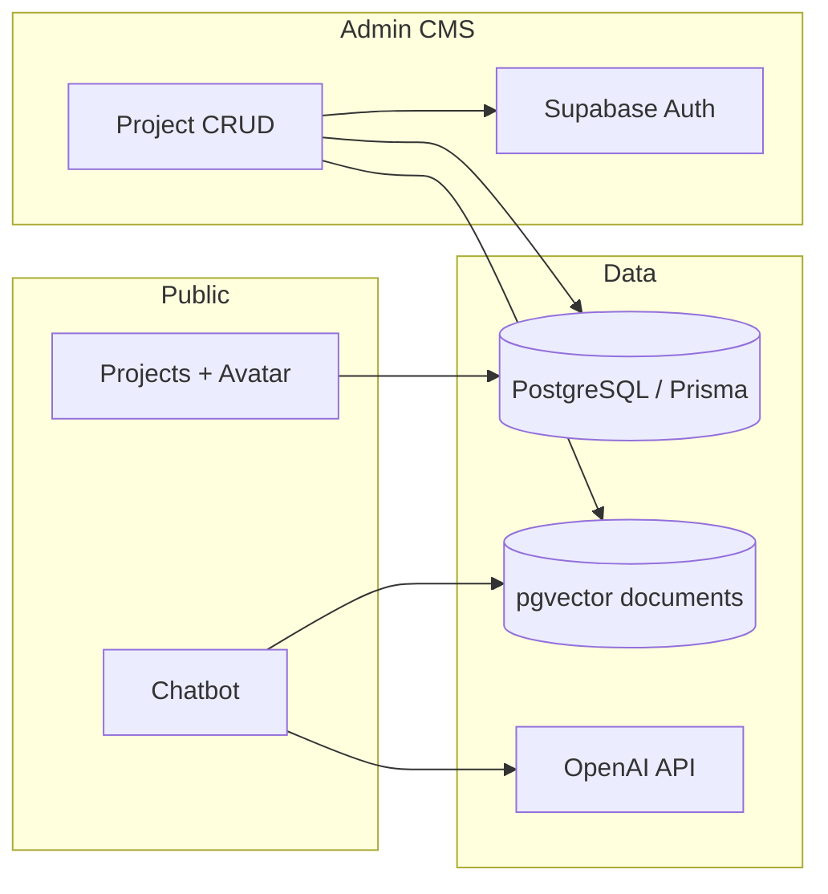

# Portfolio — Joonho Kim

Personal portfolio and CMS built with **Next.js 15 (App Router)**.  
Live site: [joonhokim.dev](https://www.joonhokim.dev)


## 🌟 Highlights

<p align="left">
  <a href="#highlights-en">🇺🇸 English</a> | 
  <a href="#highlights-ko">🇰🇷 한국어 요약</a> | 
  <a href="#highlights-ja">🇯🇵 日本語要約</a>
</p>

### <span id="highlights-en">🇺🇸 English</span>

- **Multilingual public site** (ko / en / ja) with project list, 3D avatar, filters, and project detail drawer
- **RAG chatbot** — OpenAI + pgvector (Supabase) retrieval over portfolio content, with FAQ flows and project deep-links
- **Private admin CMS** — Supabase Auth, Prisma/PostgreSQL, drag-and-drop ordering, image upload, Zod-validated server actions
- **Production-minded** — Sentry, GA4/GTM, CI (lint + unit + e2e + build), env-based secrets, chat API rate limiting

### <span id="highlights-ko">🇰🇷 한국어 요약</span>

<details>
<summary><b>💡 핵심 하이라이트 보기 (클릭하여 펼치기)</b></summary>
<br>

- **다국어 지원 퍼블릭 사이트** (ko / en / ja): 프로젝트 목록·상세, 3D 아바타, 필터링 및 드로어(Drawer) 구현
- **RAG 기반 챗봇**: OpenAI API와 pgvector(Supabase)를 연동하여 포트폴리오 콘텐츠 내 문서 검색, FAQ 시나리오 및 프로젝트 딥링크 기능 지원
- **비공개 관리자 CMS**: Supabase Auth와 Prisma/PostgreSQL 기반의 CRUD, 드래그 앤 드롭 정렬, 이미지 업로드 및 Zod 스키마로 검증된 Server Actions 적용
- **프로덕션 지향 아키텍처**: Sentry 에러 트래킹, GA4/GTM 분석, GitHub Actions CI 파이프라인(Lint + Unit + E2E + Build), 환경 변수 기반 암호화, 챗봇 API 요청 제한(Rate Limiting) 반영
</details>

### <span id="highlights-ja">🇯🇵 日本語要約</span>

<details>
<summary><b>💡 主なハイライトを表示 (クリックして展開)</b></summary>
<br>

- **多言語対応パブリックサイト** (ko / en / ja): プロジェクト一覧・詳細、3Dアバター、フィルタリング、詳細表示ドロワー（Drawer）機能を搭載
- **RAGベースのチャットボット**: OpenAI + pgvector (Supabase) を活用し、ポートフォリオ内のコンテンツに基づくドキュメント検索、FAQフロー、プロジェクトへのディープリンクをサポート
- **非公開の管理者用CMS**: Supabase Auth、Prisma/PostgreSQL、ドラッグ＆ドロップによる並び替え、画像アップロード、Zodによるバリデーションを経た Server Actions を実装
- **プロダクション環境を意識した設計**: Sentry によるエラー追跡、GA4/GTM 解析、CIパイプライン（Lint + Unit + E2E + Build）、環境変数によるシークレット管理、チャットAPIのレート制限（Rate Limiting）を適用
</details>

## Tech stack

| Layer     | Choices                                                     |
| --------- | ----------------------------------------------------------- |
| Framework | Next.js 15, React 19, TypeScript                            |
| Styling   | Tailwind CSS 4, Framer Motion, next-themes                  |
| i18n      | next-intl                                                   |
| Data      | Prisma 7, PostgreSQL, Supabase (Auth, Storage, pgvector)    |
| AI / RAG  | LangChain, OpenAI (`gpt-4o-mini`, `text-embedding-3-small`) |
| 3D        | React Three Fiber, drei                                     |
| Quality   | Vitest, Playwright, ESLint, GitHub Actions                  |

## Architecture

The codebase favors **colocation by responsibility** rather than a generic `services/` layer:

```
src/
├── app/                         # App Router, API routes, admin server actions
├── modules/projects/            # Server domain — repository → service → mapper (Nest API)
├── features/chatbot/            # Chatbot feature slice (UI + hooks + lib)
├── constants/
│   ├── admin-routes.ts          # ADMIN_PATH, ADMIN_ROUTES
│   └── breakpoints.ts           # Responsive layout + media-query helpers
├── lib/
│   ├── analytics/               # GTM / GA4 (e.g. trackProjectItemClick)
│   ├── projects/                # Public project UI helpers (scroll math, motion presets)
│   ├── http/                    # nest-client, api-error
│   ├── rag/                     # Embedding + portfolio document indexing
│   └── supabase/                # Admin client, hostname helpers
├── components/
│   ├── main/                    # Home shell — Main + desktop/tablet/mobile layouts
│   ├── projects/                # ProjectList, ProjectDetail, ProjectDrawer
│   │   ├── project-list/        # List item, title, hover preview
│   │   └── project-detail/      # Detail sections (hero, meta, tools, …)
│   ├── intro/                   # Avatar, about-me, resume link
│   └── header/                  # Nav, filters, theme toggle
├── hooks/                       # Shared React hooks (see table below)
└── stores/                      # Zustand (chatbot UI state)
```

**Where things go**

| Kind | Location | Example |
|------|----------|---------|
| Server/domain logic | `modules/` | `projects.service.ts`, import via `modules/projects` |
| Feature slice (UI + hooks) | `features/` | `features/chatbot/hooks/useChatbotMessaging` |
| Shared React hooks | `hooks/` | `useProjectSelection`, `useBreakpoints` |
| Pure UI helpers (no React) | `lib/` | `lib/projects/project-list-scroll.ts` |
| App-wide constants | `constants/` | `breakpoints.ts`, `admin-routes.ts` |
| UI components | `components/` | `ProjectListItem.tsx` — no hooks or lib utils here |
| Route-specific admin hooks | `app/.../project-form/` | `useProjectFormSubmit` (colocated with form) |

**Shared hooks (`src/hooks/`)**

| Hook | Role |
|------|------|
| `useBreakpoints` | Project detail panel — mobile / tablet / desktop (≤767 / 768–1223 / ≥1224) |
| `useLayoutBreakpoints` | Home shell — mobile / 2-column / desktop (≤768 / 769–1279 / ≥1280) |
| `useProjectSelection` | URL `?item=`, drawer open/close, analytics on click |
| `useProjectListInteractions` | List keyboard nav, Lenis scroll-to-item, hover preview |
| `useLenisPanelScroll` / `useLenisWrapperScroll` | Smooth scroll (intro, detail, list columns) |
| `useTabletDevice` | Touch/coarse-pointer tablet detection (hover preview off) |

**Public home layout**

| Viewport | Layout |
|----------|--------|
| ≥1280px | 3 columns — Intro · Project list · Project detail |
| 769–1279px | 2 columns — Intro · list (each column scrolls; detail in drawer) |
| ≤768px | Stacked — Intro then list (detail in drawer) |

Constants live in `constants/breakpoints.ts`; prefer hooks over inline `window.innerWidth` checks.

**Data flow (public projects)**

When `API_URL` is set, `modules/projects` reads from the Nest API (`lib/http/nest-client.ts`). Otherwise Prisma is used locally. Public pages consume `ProjectView` (locale-flattened); admin CMS uses `ProjectAdminView` with full i18n JSON.

## 🎯 Design choices

<p align="left">
  <a href="#design-en">🇺🇸 English</a> | 
  <a href="#design-ko">🇰🇷 한국어 기술 결정</a> | 
  <a href="#design-ja">🇯🇵 日本語の設計選択</a>
</p>

#### <span id="design-en">🇺🇸 English</span>

- **`modules/projects/`** — layered domain module (repository → service → mapper); Nest API via `API_URL` when set; `ProjectView` is locale-resolved for public UI, `ProjectAdminView` keeps i18n for CMS.
- **`features/chatbot/`** — user-facing feature module; depends on `modules/projects`, not the other way around.
- **Public UI** — `components/main/` layout shells + `components/projects/`; shared behavior in `hooks/`; Lenis smooth scroll on intro/list/detail desktop columns.
- **i18n** — public copy uses the `projects` namespace (`messages/*.json`); seed data in `prisma/seed-data/projects.data.ts`.
- **Admin routes** — server actions colocated with routes; mutations go through `modules/projects` service, not direct DB/API calls in components.
- **Security** — no hardcoded secrets; admin signup gated by env; middleware session checks; `/api/chat` rate-limited per IP.

#### <span id="design-ko">🇰🇷 한국어 기술 결정</span>

<details>
<summary><b>🛠️ 설계 및 아키텍처 초이스 보기 (클릭하여 펼치기)</b></summary>
<br>

- **`modules/projects/`**: repository → service → mapper 레이어로 Nest API(`API_URL`)와 UI를 분리했으며, 공개 UI용 `ProjectView`는 locale 기준으로 펼친 모델, 어드민용 `ProjectAdminView`는 i18n JSON을 유지합니다.
- **`features/chatbot/`**: UI·스트리밍·FAQ 등 사용자 기능은 feature 모듈로, 데이터 접근은 `modules/projects`에 위임합니다.
- **Public UI**: `components/main/` 레이아웃 + `components/projects/`; 공유 로직은 `hooks/`; intro/list/detail 컬럼은 Lenis 스무스 스크롤.
- **i18n**: 퍼블릭 카피는 `projects` 네임스페이스; 시드는 `prisma/seed-data/projects.data.ts`.
- **Admin routes**: Server Actions는 라우트 폴더에 colocation하고, 프로젝트 CRUD는 `modules/projects` service를 통해서만 수행합니다.
- **Security (보안)**: 하드코딩된 시크릿 키가 없으며, 관리자 회원가입은 환경 변수로 원천 차단됩니다. 미들웨어 세션 체크 및 `/api/chat` 경로에 대한 IP별 요청 제한이 적용되어 있습니다.
</details>

#### <span id="design-ja">🇯🇵 日本語の設計選択</span>

<details>
<summary><b>🛠️ アーキテクチャ設計における選択を表示 (クリックして展開)</b></summary>
<br>

- **`modules/projects/`**: repository → service → mapper のレイヤーで Nest API と UI を分離。公開 UI 向け `ProjectView` は locale 解決済み、管理画面向け `ProjectAdminView` は i18n JSON を保持します。
- **`features/chatbot/`**: ユーザー向け機能は feature モジュールに、データアクセスは `modules/projects` に委譲します。
- **Admin Routes**: Server Actions はルートフォルダに colocation し、プロジェクト CRUD は `modules/projects` service 経由のみです。
- **セキュリティ(Security)**: 各種シークレットは環境変数で厳格に管理され、管理者登録は環境変数によって制限されています。ミドルウェアによるセッションチェック、および `/api/chat` パスに対するIPごとのレート制限が実装されています。
</details>



## Getting started

### Prerequisites

- Node.js 22+
- PostgreSQL database
- Supabase project (Auth, Storage, pgvector extension)
- OpenAI API key

### Setup

```bash
git clone https://github.com/Louis-jk/portfolio.git
cd portfolio
pnpm install
cp .env.example .env.local
# Fill in .env.local (see file for all variables)
pnpm exec prisma migrate deploy   # or db push for local dev
pnpm db:seed             # optional sample data
pnpm dev
```

Open [http://localhost:3000](http://localhost:3000).

### Scripts

| Command                     | Description                                        |
| --------------------------- | -------------------------------------------------- |
| `pnpm dev`               | Development server                                 |
| `pnpm build`             | Production build                                   |
| `pnpm lint`              | ESLint                                             |
| `pnpm test`              | Vitest unit tests                                  |
| `pnpm test:e2e`          | Playwright (requires `DATABASE_URL` for home spec) |
| `pnpm db:seed`           | Seed database                                      |
| `pnpm db:embed-existing` | Re-index existing projects for RAG                 |

## Environment variables

Copy `.env.example` to `.env.local`. Never commit real secrets.

**Required for core features:** `DATABASE_URL`, `DIRECT_URL`, Supabase URL/keys, `OPENAI_API_KEY`, `NEXT_PUBLIC_ADMIN_SECRET_PATH`.

**Optional:** `API_URL` — Nest project API base URL (public list/detail use `modules/projects` → nest-client when set).

**Production recommendations:** `NEXT_PUBLIC_ADMIN_SIGNUP_ENABLED=false`, Sentry DSN/org/project, analytics IDs as needed.

Admin UI is served under `/{locale}{NEXT_PUBLIC_ADMIN_SECRET_PATH}` (path is obscured, not secret — rely on Supabase Auth + RLS).

## Testing

```bash
pnpm test          # domain + schema unit tests (Vitest)
pnpm test:e2e      # Playwright — home, api, chatbot specs
```

CI runs **lint**, **unit-test**, **build**, and **e2e** on push and PR (see `.github/workflows/ci.yml`).

## Branch workflow

| Branch | Purpose |
|--------|---------|
| `develop` | Integration — features merge here first |
| `main` | Production (Vercel) — merge from `develop` when verified |

## Deployment

Optimized for **Vercel** (`output: 'standalone'`). Set environment variables in the Vercel dashboard and redeploy after changes.

## License

Private portfolio project — code public for review; assets and copy © Joonho Kim.
