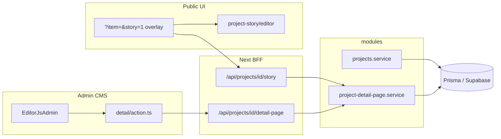
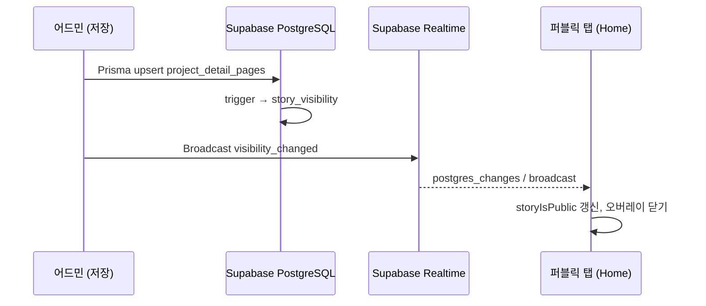
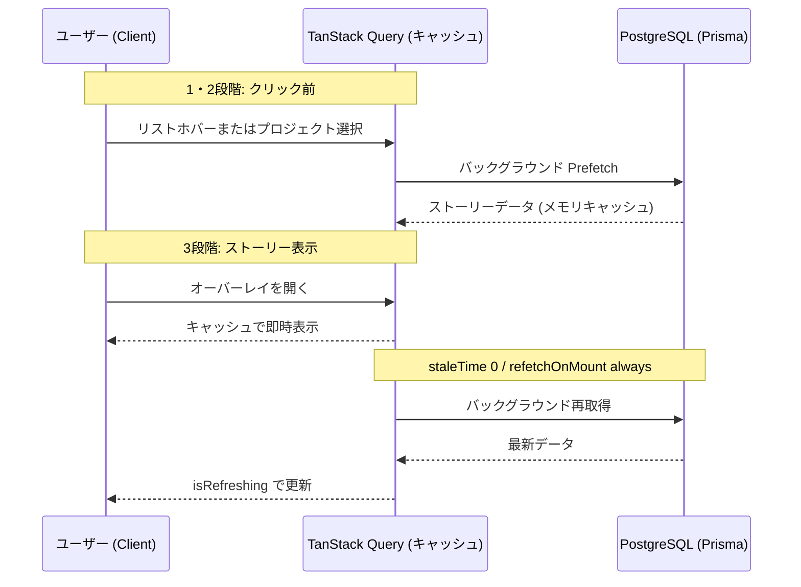
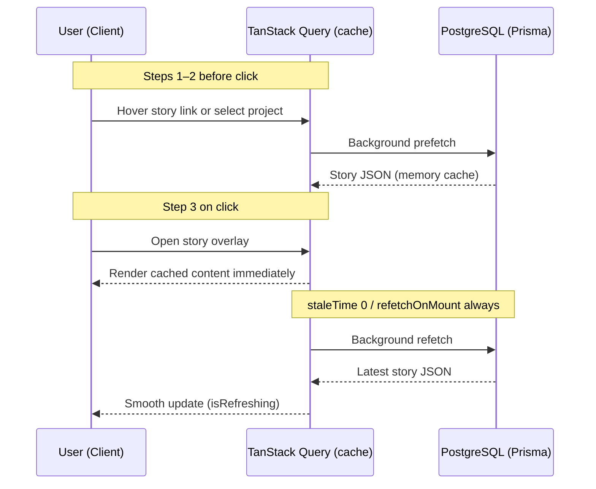

# Portfolio — Joonho Kim

[joonhokim.dev](https://www.joonhokim.dev)

## Preview

### Public site

[<video src="https://github.com/user-attachments/assets/72c4b16e-00e9-48dc-8a56-a7b583ef4bf7" width="100%" autoplay muted loop playsinline />](https://github.com/user-attachments/assets/72c4b16e-00e9-48dc-8a56-a7b583ef4bf7)

_Portfolio demo — hover, project detail, story overlay (MP4)_

### Storybook

Brand / semantic colors (`ThemeColors` story) — same page, light and dark theme.


### Optional showcases

Admin CMS shots are optional — add only if you want to highlight them. Mask or crop any secret URL path in the address bar or page chrome.

## Documentation

<details>
<summary><b>🇰🇷 한국어</b></summary>

Next.js 15 기반 다국어 포트폴리오 및 CMS입니다. **Next.js 15**, **React 19**, **TanStack Query 5**, **Tailwind CSS 4**, **Prisma 7**, **Storybook 10**을 사용합니다.

### 핵심 하이라이트

- **다국어 퍼블릭 사이트** (ko / en / ja): 프로젝트 목록·상세, 3D 아바타, 필터, 드로어
- **상세 스토리**: 어드민 Editor.js 다국어 편집 + 퍼블릭 `?item=&story=1` 오버레이. **TanStack Query** prefetch·stale-while-revalidate
- **RAG 챗봇**: OpenAI + pgvector(Supabase), FAQ·프로젝트 딥링크
- **비공개 CMS**: Supabase Auth, Prisma/PostgreSQL, DnD 정렬, 이미지 업로드, Zod Server Actions
- **프로덕션**: Sentry, GA4, CI(lint·unit·build), env 시크릿, 챗 API rate limit

### 기술 스택

[](https://nextjs.org/)
[](https://react.dev/)
[](https://www.typescriptlang.org/)
[](https://tailwindcss.com/)
[](https://www.prisma.io/)
[](https://storybook.js.org/)
[](https://tanstack.com/query)

| 계층            | 선택                                                               |
| --------------- | ------------------------------------------------------------------ |
| **Framework**   | Next.js 15 · React 19 · TypeScript 5                               |
| **Styling**     | Tailwind CSS 4 · Framer Motion · next-themes                       |
| **Client data** | TanStack Query 5 — prefetch, deduplication, stale-while-revalidate |
| **i18n**        | next-intl (ko / en / ja)                                           |
| **Data**        | Prisma 7 · PostgreSQL · Supabase (Auth, Storage, Realtime, pgvector) |
| **AI / RAG**    | LangChain · OpenAI (`gpt-4o-mini`, `text-embedding-3-small`)       |
| **3D**          | React Three Fiber · drei                                           |
| **Quality**     | Vitest · Playwright · ESLint · GitHub Actions · Storybook 10       |

### 아키텍처

코드베이스는 **책임별 colocation** — `services/` 트리 대신 레이어 소유권에 맞게 배치합니다.

**레이어 역할**

| 레이어        | 역할 |
| ------------- | ---- |
| `entities/`   | **도메인 엔티티** — model·pure lib·server (React UI 없음) |
| `entities/projects/` | 프로젝트 카탈로그 model·query·server |
| `entities/project-detail-page/` | Editor.js 스토리 model·변환·server |
| `lib/`        | 인프라 헬퍼 (Prisma, Supabase, sanitize — 도메인 비즈니스 없음) |
| `features/`   | **기능 슬라이스** — UI·훅·기능 전용 로직 |
| `features/projects/public/` | 퍼블릭 프로젝트 UI (목록·드로어·스토리) |
| `features/projects/admin/` | 어드민 CMS (폼·Editor.js·관리 목록) |
| `widgets/`    | **페이지 조립** — feature + shared components를 한 화면으로 묶음 |
| `components/` | **앱 전역** 공유 UI (`ui/`, `header/`, `footer/` — feature import 없음) |
| `hooks/`      | 여러 feature에서 쓰는 공유 React 훅 (도메인 훅은 feature 내부) |
| `app/`        | 라우트, BFF API, server actions |
| `test/`       | Vitest 단위 테스트 (`src/` 구조 미러, e2e는 `e2e/`) |

**import 규칙** (ESLint로 강제)

- `app/` → `widgets/*`, `features/*`, `entities/*`, `components/*`
- `widgets/` → `features/*`, `entities/*`, `components/*`, `hooks/*`
- `features/projects/admin` → `features/projects/public` (미리보기), `entities/*`, `lib/*`
- `features/projects/public` → `entities/*`, `lib/*` — **admin을 import하지 않음**
- `entities/` → `lib/*` (인프라만) — **features·components import 금지**
- `components/` → `hooks/*`, `lib/*` — **feature·widget import 금지**

**디렉터리 구조 (요약)**

```text
src/
├── app/
│   ├── [locale]/                    # Public pages + admin routes
│   └── api/projects/[id]/
│       ├── detail-page/             # BFF — auth CRUD → Prisma
│       └── story/                   # BFF — public read
├── entities/
│   ├── projects/                    # model · lib · server
│   └── project-detail-page/
├── features/
│   ├── projects/
│   │   ├── public/                  # visitor UI + domain hooks
│   │   └── admin/                   # CMS + Editor.js
│   ├── chatbot/
│   └── admin/                       # admin shell (nav, logout)
├── widgets/
│   ├── home/
│   └── main/
├── components/
│   ├── ui/
│   ├── header/
│   └── footer/
├── lib/                             # infra only (prisma, supabase, …)
└── hooks/                           # cross-feature hooks
test/                                # Vitest (mirrors src layout)
e2e/                                 # Playwright
```

**스토리 플로우**: 어드민 Editor.js JSON → BFF `/api/projects/[id]/story` → 퍼블릭 `?item=&story=1` 오버레이



### 데이터 계층: Nest API → Prisma 직결

이전에는 별도 **Nest.js 백엔드**가 Supabase PostgreSQL에 REST로 접근했습니다. 포트폴리오 규모에서는 **항상 켜 둘 서버 비용·운영 부담**이 컸고, Next.js(Vercel)만으로도 Server Actions·BFF·Prisma로 동일 기능을 구현할 수 있어 **Prisma 직접 연결**로 전환했습니다.

| 항목 | 이전 (Nest) | 현재 |
| ---- | ----------- | ---- |
| 프로젝트·스토리 CRUD | Nest REST → DB | Next `entities/*/server` → **Prisma** → Supabase PostgreSQL |
| 어드민 인증 | Supabase Auth | 동일 (Supabase Auth) |
| 이미지 | Supabase Storage | 동일 |
| RAG 벡터 | pgvector | 동일 (Prisma / SQL) |
| 별도 API 서버 | 필요 | **불필요** (`nest-client` 제거) |

스키마는 Nest와 동일한 **JSONB i18n** 형태(`projects`, `project_detail_pages`)를 유지합니다.

### 스토리 공개 상태 실시간 반영 (Supabase Realtime)

어드민에서 스토리 **공개/비공개**를 바꾸면, 이미 열려 있는 퍼블릭 탭에도 **새로고침 없이** 「스토리 보기」버튼 표시·숨김이 반영됩니다.

- **`story_visibility` 테이블** — `project_id` + `is_public`만 노출 (스토리 JSONB는 REST/Realtime으로 노출하지 않음). `project_detail_pages` 변경 시 DB 트리거로 동기화
- **Postgres Changes** — 클라이언트가 `story_visibility` 구독 (`useStoryVisibilityRealtime`)
- **Broadcast** — 어드민 저장 시 서버가 즉시 푸시 (`broadcastStoryVisibilityChange`)
- **클라이언트 상태** — `useLiveProjects`가 SSR 목록의 `storyIsPublic`을 실시간 갱신



**환경 변수:** `DATABASE_URL`, `NEXT_PUBLIC_SUPABASE_URL`, `NEXT_PUBLIC_SUPABASE_PUBLISHABLE_DEFAULT_KEY`, `SUPABASE_SERVICE_ROLE_KEY`는 **같은 Supabase 프로젝트**에서 발급된 값이어야 합니다 (ref 불일치 시 Realtime·Auth가 조용히 실패할 수 있음). 확인: `pnpm exec tsx scripts/check-supabase-env-alignment.ts`

**마이그레이션:** Realtime용 SQL은 `prisma/migrations/20250613120000_story_visibility_realtime/`에 있습니다. 배포·로컬 DB에 `pnpm db:migrate` 한 번 실행하세요.

### 기술 결정

- **`entities/projects/`**: model · lib · server (repository → service → mapper)
- **`entities/project-detail-page/`**: Editor.js 스토리 도메인, 렌더는 `features/projects/public/project-story/editor/`
- **`features/chatbot/`**: UI는 feature, 데이터는 `entities/projects`
- **`features/projects/admin/editor/`**: locale 탭(ko/ja/en) i18n 블록
- **Public UI**: `?item=&story=1` 오버레이, TanStack Query (`lib/projects/project-story-query.ts`)
- **Security**: env 시크릿, 미들웨어 세션, `/api/chat` rate limit, HTML sanitization

### 스토리 로딩 성능 최적화

**「스토리 보기」** UX를 위해 TanStack Query prefetch·캐싱을 적용한 사례입니다.

기존에는 클릭 시점에만 API fetch가 시작되어 cold fetch 지연이 있었습니다. 사용자 흐름(상세 진입 → hover → 클릭)에 맞춘 3단계 레이어를 구축했습니다.

- **Prefetch**: 프로젝트 선택·스토리 링크 hover/focus (`staleTime: 0`, deduplication)
- **즉시 렌더**: 캐시로 오버레이 즉시 표시 (체감 ≈ 0초)
- **백그라운드 동기화**: `refetchOnMount: 'always'`로 어드민 수정 반영


### 참고

훅·환경 변수 등 기술 레퍼런스입니다.

#### 공유 훅 (`src/hooks/`)

| 훅                           | 역할                                           |
| ---------------------------- | ---------------------------------------------- |
| `useBreakpoints`             | 상세 패널 — mobile / tablet / desktop          |
| `useLayoutBreakpoints`       | 홈 레이아웃 — mobile / 2열 / desktop           |
| `useProjectSelection`        | URL `?item=`, 드로어, analytics                |
| `useProjectStory`            | URL `?story=1` 오버레이                        |
| `usePrefetchProjectStory`    | hover·focus·선택 시 스토리 prefetch            |
| `useLiveProjects`            | SSR 목록 + Realtime `storyIsPublic` 동기화     |
| `useStoryVisibilityRealtime` | Supabase Realtime 구독 (`story_visibility`)  |
| `useProjectListInteractions` | 키보드 nav, Lenis 스크롤, hover 프리뷰         |

#### 환경 변수

`.env.example` → `.env.local`로 복사하세요. 시크릿은 커밋하지 마세요.

**필수:** `DATABASE_URL`, `DIRECT_URL`, Supabase URL/keys, `OPENAI_API_KEY`, `NEXT_PUBLIC_ADMIN_SECRET_PATH`

`DATABASE_URL`의 Supabase project ref와 `NEXT_PUBLIC_SUPABASE_URL`·publishable key·`SUPABASE_SERVICE_ROLE_KEY`가 **동일 프로젝트**여야 Realtime·Auth·Storage가 Prisma와 맞습니다.

#### 테스트 & CI

```bash
pnpm test          # Vitest
pnpm test:e2e      # Playwright
```

push/PR 시 **lint**, **unit-test**, **build**가 실행됩니다.

### 시작하기

```bash
git clone https://github.com/Louis-jk/portfolio.git
cd portfolio
pnpm install
cp .env.example .env.local
pnpm exec prisma migrate deploy
pnpm db:seed
pnpm dev
```

| 명령             | 설명             |
| ---------------- | ---------------- |
| `pnpm dev`       | 개발 서버        |
| `pnpm build`     | 프로덕션 빌드    |
| `pnpm test`      | Vitest           |
| `pnpm test:e2e`  | Playwright       |
| `pnpm storybook` | Storybook (6006) |

**브랜치**: `feature/*` → `main`(프로덕션)

</details>

<details>
<summary><b>🇯🇵 日本語</b></summary>

Next.js 15 ベースの多言語ポートフォリオおよび CMS です。**Next.js 15**、**React 19**、**TanStack Query 5**、**Tailwind CSS 4**、**Prisma 7**、**Storybook 10** を使用しています。

### 主なハイライト

- **多言語パブリックサイト** (ko / en / ja): プロジェクト一覧・詳細、3Dアバター、フィルター、ドロワー
- **詳細ストーリー**: 管理画面 Editor.js 多言語編集 + 公開 `?item=&story=1` オーバーレイ。**TanStack Query** プリフェッチ・stale-while-revalidate
- **RAG チャットボット**: OpenAI + pgvector (Supabase)、FAQ・プロジェクトディープリンク
- **非公開 CMS**: Supabase Auth、Prisma/PostgreSQL、DnD 並び替え、画像アップロード、Zod Server Actions
- **プロダクション**: Sentry、GA4、CI (lint・unit・build)、env シークレット、チャット API レート制限

### 技術スタック

[](https://nextjs.org/)
[](https://react.dev/)
[](https://www.typescriptlang.org/)
[](https://tailwindcss.com/)
[](https://www.prisma.io/)
[](https://storybook.js.org/)
[](https://tanstack.com/query)

| レイヤー        | 選択                                                               |
| --------------- | ------------------------------------------------------------------ |
| **Framework**   | Next.js 15 · React 19 · TypeScript 5                               |
| **Styling**     | Tailwind CSS 4 · Framer Motion · next-themes                       |
| **Client data** | TanStack Query 5 — prefetch、deduplication、stale-while-revalidate |
| **i18n**        | next-intl (ko / en / ja)                                           |
| **Data**        | Prisma 7 · PostgreSQL · Supabase (Auth, Storage, Realtime, pgvector) |
| **AI / RAG**    | LangChain · OpenAI (`gpt-4o-mini`, `text-embedding-3-small`)       |
| **3D**          | React Three Fiber · drei                                           |
| **Quality**     | Vitest · Playwright · ESLint · GitHub Actions · Storybook 10       |

### アーキテクチャ

コードベースは **責務別 colocation** — 汎用 `services/` ツリーではなく、レイヤーの所有者に沿って配置します。

**レイヤー役割**

| レイヤー      | 役割                                    |
| ------------- | --------------------------------------- |
| `entities/`   | **ドメインエンティティ** — model · lib · server |
| `lib/`        | インフラヘルパー (Prisma, Supabase 等) |
| `features/`   | **機能スライス** — UI・フック・機能ロジック |
| `widgets/`    | **ページ組み立て** |
| `components/` | **アプリ全体** 共有 UI (feature import なし) |
| `hooks/`      | 複数 feature 共有フック |
| `app/`        | ルート、BFF API、server actions |
| `test/`       | Vitest (`src/` ミラー、e2e は `e2e/`) |

**import ルール** (ESLint で強制)

- `features/projects/public` は `admin` を import しない
- `components/` は feature・widget を import しない
- `entities/` は features・components を import しない

**ディレクトリ構成 (抜粋)**

```text
src/
├── app/
├── entities/
│   ├── projects/
│   └── project-detail-page/
├── features/
│   ├── projects/
│   ├── chatbot/
│   └── admin/
├── widgets/
├── components/
├── lib/
└── hooks/
test/
e2e/
```

**ストーリーフロー**: 管理画面 Editor.js JSON → BFF `/api/projects/[id]/story` → 公開 `?item=&story=1` オーバーレイ


### データ層: Nest API → Prisma 直結

以前は別の **Nest.js バックエンド**が Supabase PostgreSQL に REST でアクセスしていました。ポートフォリオ規模では **常時起動サーバーのコスト・運用**が負担になり、Next.js (Vercel) の Server Actions・BFF・Prisma だけで同等機能を実装できるため **Prisma 直結**に移行しました。

| 項目 | 以前 (Nest) | 現在 |
| ---- | ----------- | ---- |
| プロジェクト・ストーリー CRUD | Nest REST → DB | Next `entities/*/server` → **Prisma** → Supabase PostgreSQL |
| 管理画面認証 | Supabase Auth | 同じ |
| 画像 | Supabase Storage | 同じ |
| RAG ベクトル | pgvector | 同じ |
| 別 API サーバー | 必要 | **不要** (`nest-client` 削除) |

スキーマは Nest と同じ **JSONB i18n** (`projects`, `project_detail_pages`) です。

### ストーリー公開状態のリアルタイム反映 (Supabase Realtime)

管理画面でストーリーの **公開/非公開** を変更すると、開いている公開タブでも **リロードなし** で「ストーリーを見る」ボタンの表示が変わります。

- **`story_visibility` テーブル** — `project_id` + `is_public` のみ（ストーリー JSONB は公開しない）
- **Postgres Changes** — `useStoryVisibilityRealtime`
- **Broadcast** — 保存時にサーバーが即時プッシュ
- **クライアント** — `useLiveProjects` が `storyIsPublic` を更新

**環境変数:** `DATABASE_URL`, `NEXT_PUBLIC_SUPABASE_URL`, `NEXT_PUBLIC_SUPABASE_PUBLISHABLE_DEFAULT_KEY`, `SUPABASE_SERVICE_ROLE_KEY` は **同じ Supabase プロジェクト**の値である必要があります。`pnpm exec tsx scripts/check-supabase-env-alignment.ts`

**マイグレーション:** 各環境で `pnpm db:migrate` を一度実行してください。

### 設計選択

- **`entities/projects/`**: model · lib · server
- **`entities/project-detail-page/`**: Editor.js ストーリードメイン
- **`features/chatbot/`**: UI は feature、データは `entities/projects`
- **`features/projects/admin/editor/`**: locale タブ (ko/ja/en) i18n ブロック
- **Public UI**: `?item=&story=1` オーバーレイ、TanStack Query (`lib/projects/project-story-query.ts`)
- **セキュリティ**: env シークレット、ミドルウェアセッション、`/api/chat` レート制限、HTML sanitization

### ストーリー読み込みの性能最適化

**「ストーリーを見る」** UX 向けに TanStack Query のプリフェッチ・キャッシュを適用した事例です。

従来はクリック時のみ API フェッチが始まり、cold fetch の遅延がありました。ユーザー行動（詳細進入 → ホバー → クリック）に合わせた 3 段階レイヤーを実装しました。

- **プリフェッチ**: プロジェクト選択・ストーリーリンク hover/focus（`staleTime: 0`、deduplication）
- **即時レンダリング**: キャッシュでオーバーレイ即表示（体感 ≈ 0 秒）
- **バックグラウンド同期**: `refetchOnMount: 'always'` で管理画面の編集を反映



### リファレンス

フック・環境変数などの技術リファレンスです。

#### 共有フック (`src/hooks/`)

| フック                       | 役割                                              |
| ---------------------------- | ------------------------------------------------- |
| `useBreakpoints`             | 詳細パネル — mobile / tablet / desktop            |
| `useLayoutBreakpoints`       | ホームレイアウト — mobile / 2列 / desktop         |
| `useProjectSelection`        | URL `?item=`、ドロワー、analytics                 |
| `useProjectStory`            | URL `?story=1` オーバーレイ                       |
| `usePrefetchProjectStory`    | hover・focus・選択時のストーリー prefetch           |
| `useLiveProjects`            | SSR 一覧 + Realtime `storyIsPublic` 同期          |
| `useStoryVisibilityRealtime` | Supabase Realtime 購読                            |
| `useProjectListInteractions` | キーボード nav、Lenis スクロール、hover プレビュー |

#### 環境変数

`.env.example` を `.env.local` にコピーしてください。シークレットはコミットしないでください。

**必須:** `DATABASE_URL`, `DIRECT_URL`, Supabase URL/keys, `OPENAI_API_KEY`, `NEXT_PUBLIC_ADMIN_SECRET_PATH`

`DATABASE_URL` と `NEXT_PUBLIC_SUPABASE_URL`・publishable key・`SUPABASE_SERVICE_ROLE_KEY` は **同じ Supabase プロジェクト**を指す必要があります。

#### テスト & CI

```bash
pnpm test          # Vitest
pnpm test:e2e      # Playwright
```

push/PR 時に **lint**、**unit-test**、**build** が実行されます。

### はじめに

```bash
git clone https://github.com/Louis-jk/portfolio.git
cd portfolio
pnpm install
cp .env.example .env.local
pnpm exec prisma migrate deploy
pnpm db:seed
pnpm dev
```

| コマンド         | 説明                 |
| ---------------- | -------------------- |
| `pnpm dev`       | 開発サーバー         |
| `pnpm build`     | プロダクションビルド |
| `pnpm test`      | Vitest               |
| `pnpm test:e2e`  | Playwright           |
| `pnpm storybook` | Storybook (6006)     |

**ブランチ**: `feature/*` → `main`（本番）

</details>

<details>
<summary><b>🇺🇸 English</b></summary>

Multilingual portfolio and CMS built with **Next.js 15 (App Router)**. Stack: **Next.js 15**, **React 19**, **TanStack Query 5**, **Tailwind CSS 4**, **Prisma 7**, **Storybook 10**.

### Highlights

- **Multilingual public site** (ko / en / ja): project list, 3D avatar, filters, detail drawer
- **Rich project stories**: Editor.js admin + public `?item=&story=1` overlay; **TanStack Query** prefetch + stale-while-revalidate
- **RAG chatbot**: OpenAI + pgvector (Supabase), FAQ flows, project deep-links
- **Private admin CMS**: Supabase Auth, Prisma/PostgreSQL, drag-and-drop, image upload, Zod server actions
- **Production-minded**: Sentry, GA4, CI (lint + unit + build), env secrets, chat API rate limiting

### Tech stack

[](https://nextjs.org/)
[](https://react.dev/)
[](https://www.typescriptlang.org/)
[](https://tailwindcss.com/)
[](https://www.prisma.io/)
[](https://storybook.js.org/)
[](https://tanstack.com/query)

| Layer           | Choices                                                            |
| --------------- | ------------------------------------------------------------------ |
| **Framework**   | Next.js 15 · React 19 · TypeScript 5                               |
| **Styling**     | Tailwind CSS 4 · Framer Motion · next-themes                       |
| **Client data** | TanStack Query 5 — prefetch, deduplication, stale-while-revalidate |
| **i18n**        | next-intl (ko / en / ja)                                           |
| **Data**        | Prisma 7 · PostgreSQL · Supabase (Auth, Storage, Realtime, pgvector) |
| **AI / RAG**    | LangChain · OpenAI (`gpt-4o-mini`, `text-embedding-3-small`)       |
| **3D**          | React Three Fiber · drei                                           |
| **Quality**     | Vitest · Playwright · ESLint · GitHub Actions · Storybook 10       |

### Architecture

The codebase favors **colocation by responsibility** — related code lives next to the layer that owns it.

**Layer roles**

| Layer         | Role                                   |
| ------------- | -------------------------------------- |
| `entities/`   | **Domain entities** — model, pure lib, server |
| `lib/`        | Infrastructure helpers (no domain business) |
| `features/`   | **Feature slices** — UI, hooks, feature logic |
| `widgets/`    | **Page composition** |
| `components/` | **App-wide** shared UI (no feature imports) |
| `hooks/`      | Cross-feature React hooks |
| `app/`        | Routes, BFF API, server actions |
| `test/`       | Vitest unit tests (mirrors `src/`, e2e in `e2e/`) |

**Import rules** (enforced by ESLint)

- `features/projects/public` must not import `admin`
- `components/` must not import features or widgets
- `entities/` must not import features or components

**Directory tree (selected)**

```text
src/
├── app/
├── entities/
│   ├── projects/
│   └── project-detail-page/
├── features/
├── widgets/
├── components/
├── lib/
└── hooks/
test/
e2e/
```

**Story flow**: Admin Editor.js JSON → BFF `/api/projects/[id]/story` → public `?item=&story=1` overlay


### Data layer: Nest API → Prisma direct

Previously a separate **Nest.js backend** exposed REST over Supabase PostgreSQL. For a portfolio-sized app, **always-on server cost and ops** were hard to justify; Next.js (Vercel) already provides Server Actions, BFF routes, and Prisma, so the app now uses **Prisma direct** to Supabase.

| Area | Before (Nest) | Now |
| ---- | ------------- | --- |
| Project & story CRUD | Nest REST → DB | Next `entities/*/server` → **Prisma** → Supabase PostgreSQL |
| Admin auth | Supabase Auth | Same |
| Images | Supabase Storage | Same |
| RAG vectors | pgvector | Same |
| Separate API server | Required | **Not required** (`nest-client` removed) |

The schema keeps Nest-compatible **JSONB i18n** (`projects`, `project_detail_pages`).

### Live story visibility (Supabase Realtime)

When an admin toggles story **public / private**, open public tabs update the “view story” button **without a full page reload**.

- **`story_visibility` table** — only `project_id` + `is_public` (no story JSONB over Realtime)
- **Postgres Changes** — `useStoryVisibilityRealtime` subscribes on the client
- **Broadcast** — server pushes on save (`broadcastStoryVisibilityChange`)
- **Client state** — `useLiveProjects` merges live `storyIsPublic` into the SSR project list

**Env:** `DATABASE_URL`, `NEXT_PUBLIC_SUPABASE_URL`, `NEXT_PUBLIC_SUPABASE_PUBLISHABLE_DEFAULT_KEY`, and `SUPABASE_SERVICE_ROLE_KEY` must all come from the **same Supabase project** (mismatched keys can silently break Realtime). Check: `pnpm exec tsx scripts/check-supabase-env-alignment.ts`

**Migrations:** run `pnpm db:migrate` once per environment (includes `20250613120000_story_visibility_realtime`).

### Design choices

- **`entities/projects/`** — model · lib · server
- **`entities/project-detail-page/`** — Editor.js story domain; render in `features/projects/public/project-story/editor/`
- **`features/chatbot/`** — UI in feature; data from `entities/projects`
- **`features/projects/admin/editor/`** — per-locale (ko/ja/en) i18n blocks
- **Public UI** — `?item=&story=1` overlay; TanStack Query in `lib/projects/project-story-query.ts`
- **Security** — env secrets, middleware sessions, `/api/chat` rate limit, HTML sanitization

### Story loading performance

**View story** uses TanStack Query prefetch and caching for a snappier overlay.

Previously, the API fetch started only on click (cold fetch). A three-step client layer matches user intent (select project → hover link → open overlay):

1. **Prefetch** on selection and hover/focus (`staleTime: 0`, deduplication)
2. **Instant render** from cache when overlay mounts (≈ 0s perceived wait)
3. **Background refetch** (`refetchOnMount: 'always'`) for fresh admin edits



### Reference

Technical reference for hooks and environment variables.

#### Shared hooks (`src/hooks/`)

| Hook                         | Role                                      |
| ---------------------------- | ----------------------------------------- |
| `useBreakpoints`             | Detail panel — mobile / tablet / desktop  |
| `useLayoutBreakpoints`       | Home shell — mobile / 2-col / desktop     |
| `useProjectSelection`        | URL `?item=`, drawer, analytics           |
| `useProjectStory`            | URL `?story=1` overlay                    |
| `usePrefetchProjectStory`    | Prefetch story on hover, focus, selection |
| `useLiveProjects`            | SSR list + live `storyIsPublic` from Realtime |
| `useStoryVisibilityRealtime` | Supabase Realtime subscription               |
| `useProjectListInteractions` | Keyboard nav, Lenis scroll, hover preview |

#### Environment variables

Copy `.env.example` → `.env.local`. Never commit secrets.

**Required:** `DATABASE_URL`, `DIRECT_URL`, Supabase URL/keys, `OPENAI_API_KEY`, `NEXT_PUBLIC_ADMIN_SECRET_PATH`

`DATABASE_URL`, `NEXT_PUBLIC_SUPABASE_URL`, publishable key, and `SUPABASE_SERVICE_ROLE_KEY` must point at the **same Supabase project** for Realtime, Auth, and Storage to match Prisma.

#### Testing & CI

```bash
pnpm test          # Vitest
pnpm test:e2e      # Playwright
```

CI runs **lint**, **unit-test**, and **build** on push/PR.

### Getting started

```bash
git clone https://github.com/Louis-jk/portfolio.git
cd portfolio
pnpm install
cp .env.example .env.local
pnpm exec prisma migrate deploy
pnpm db:seed
pnpm dev
```

| Command          | Description           |
| ---------------- | --------------------- |
| `pnpm dev`       | Development server    |
| `pnpm build`     | Production build      |
| `pnpm test`      | Vitest unit tests     |
| `pnpm test:e2e`  | Playwright            |
| `pnpm storybook` | Storybook (port 6006) |

**Branches**: `feature/*` → `main` (production)

</details>

## License

Private portfolio project — code public for review; assets and copy © Joonho Kim.
