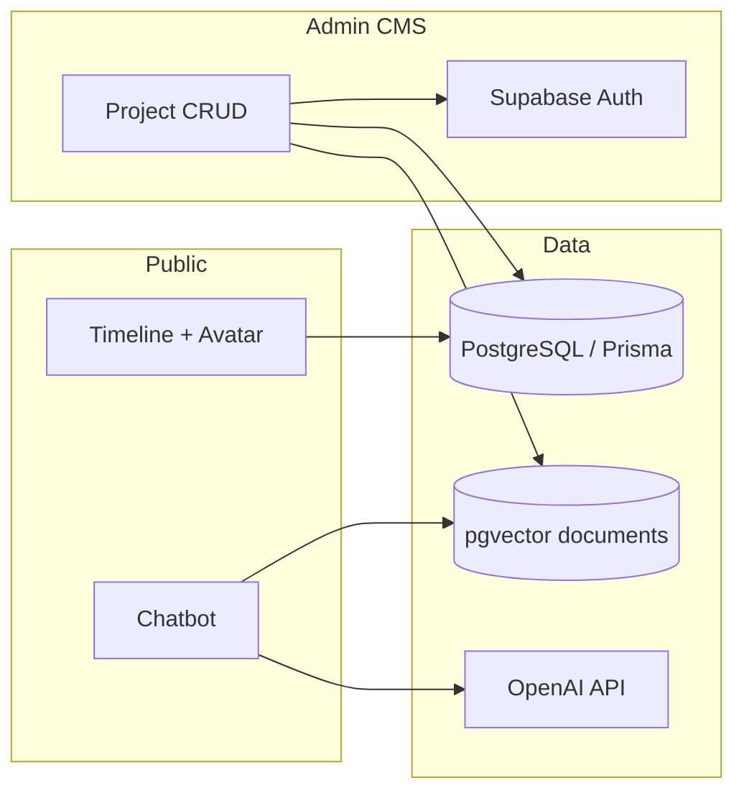

# Portfolio — Joonho Kim

Personal portfolio and CMS built with **Next.js 15 (App Router)**.  
Live site: [joonhokim.dev](https://www.joonhokim.dev)


## Highlights

- **Multilingual public site** (ko / en / ja) with timeline, 3D avatar, filters, and project detail drawer
- **RAG chatbot** — OpenAI + pgvector (Supabase) retrieval over portfolio content, with FAQ flows and project deep-links
- **Private admin CMS** — Supabase Auth, Prisma/PostgreSQL, drag-and-drop ordering, image upload, Zod-validated server actions
- **Production-minded** — Sentry, GA4/GTM, CI (lint + unit + e2e + build), env-based secrets, chat API rate limiting

## Tech stack

| Layer | Choices |
|-------|---------|
| Framework | Next.js 15, React 19, TypeScript |
| Styling | Tailwind CSS 4, Framer Motion, next-themes |
| i18n | next-intl |
| Data | Prisma 7, PostgreSQL, Supabase (Auth, Storage, pgvector) |
| AI / RAG | LangChain, OpenAI (`gpt-4o-mini`, `text-embedding-3-small`) |
| 3D | React Three Fiber, drei |
| Quality | Vitest, Playwright, ESLint, GitHub Actions |

## Architecture

The codebase favors **colocation by responsibility** rather than a generic `services/` layer:

```
src/
├── app/                    # Routes, API handlers, server actions (admin CMS)
├── features/chatbot/       # Chatbot UI, hooks, and domain helpers
│   ├── components/
│   ├── hooks/
│   └── lib/
├── lib/
│   ├── projects/           # Project domain — queries, mappers, Zod validation
│   ├── rag/                # Embedding + portfolio document indexing
│   └── supabase/           # Admin client, hostname helpers
├── components/             # Shared public UI (timeline, header, intro, …)
├── hooks/                  # Cross-feature hooks (e.g. useMounted)
└── stores/                 # Zustand (chatbot UI state)
```

**Design choices**

- **`lib/projects/`** — domain module extracted from a monolithic form/service; server payloads validated with Zod before Prisma writes.
- **`features/chatbot/`** — chatbot grew across UI, streaming, FAQ, and moderation; grouped as a feature module instead of a flat `components/` folder.
- **Admin routes** — server actions live next to routes (`actions.ts`, `upload-image.ts`); shared rules stay in `lib/projects/`.
- **Security** — no hardcoded secrets; admin signup gated by env; middleware session checks; `/api/chat` rate-limited per IP.



## Getting started

### Prerequisites

- Node.js 22+
- PostgreSQL database
- Supabase project (Auth, Storage, pgvector extension)
- OpenAI API key

### Setup

```bash
git clone https://github.com/Louis-jk/portfolio.git
cd portfolio
npm ci
cp .env.example .env.local
# Fill in .env.local (see file for all variables)
npx prisma migrate deploy   # or db push for local dev
npm run db:seed             # optional sample data
npm run dev
```

Open [http://localhost:3000](http://localhost:3000).

### Scripts

| Command | Description |
|---------|-------------|
| `npm run dev` | Development server |
| `npm run build` | Production build |
| `npm run lint` | ESLint |
| `npm run test` | Vitest unit tests |
| `npm run test:e2e` | Playwright (requires `DATABASE_URL` for home spec) |
| `npm run db:seed` | Seed database |
| `npm run db:embed-existing` | Re-index existing projects for RAG |

## Environment variables

Copy `.env.example` to `.env.local`. Never commit real secrets.

**Required for core features:** `DATABASE_URL`, `DIRECT_URL`, Supabase URL/keys, `OPENAI_API_KEY`, `NEXT_PUBLIC_ADMIN_SECRET_PATH`.

**Production recommendations:** `NEXT_PUBLIC_ADMIN_SIGNUP_ENABLED=false`, Sentry DSN/org/project, analytics IDs as needed.

Admin UI is served under `/{locale}{NEXT_PUBLIC_ADMIN_SECRET_PATH}` (path is obscured, not secret — rely on Supabase Auth + RLS).

## Testing

```bash
npm run test          # domain + schema unit tests
npm run test:e2e      # smoke / health checks
```

CI runs lint, unit tests, e2e, and production build on push and PR.

## Deployment

Optimized for **Vercel** (`output: 'standalone'`). Set environment variables in the Vercel dashboard and redeploy after changes.

## License

Private portfolio project — code public for review; assets and copy © Joonho Kim.
