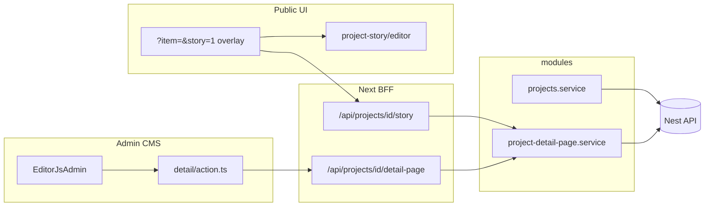
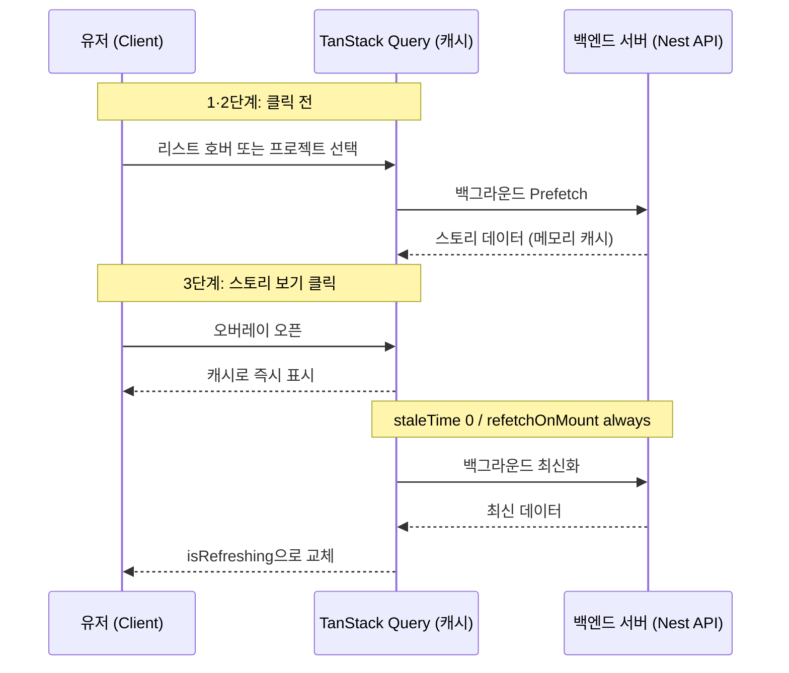
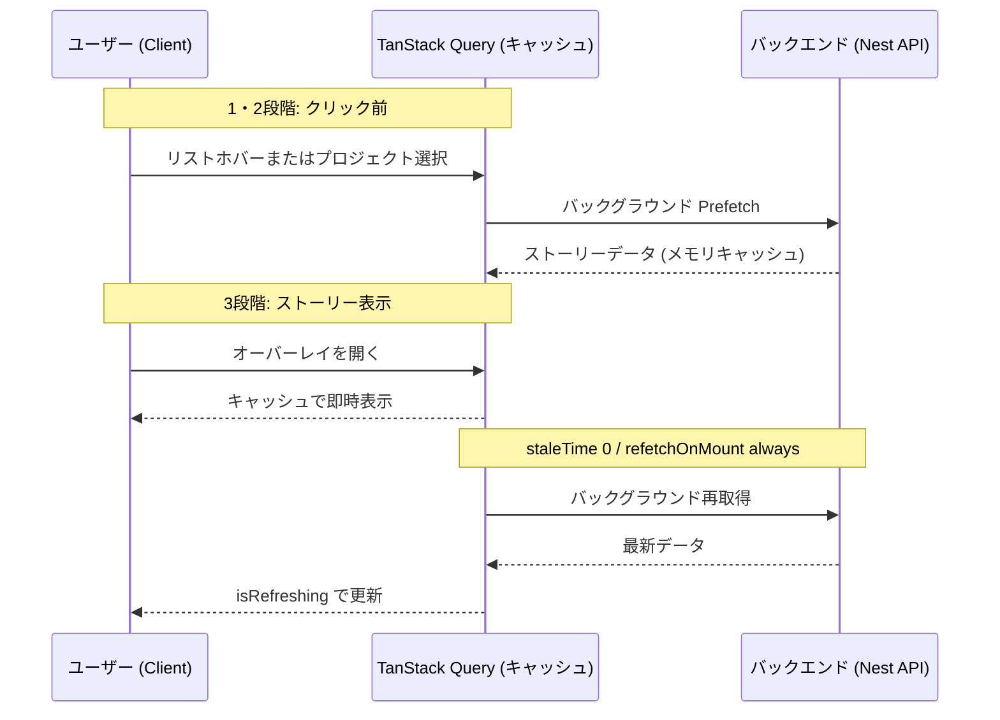
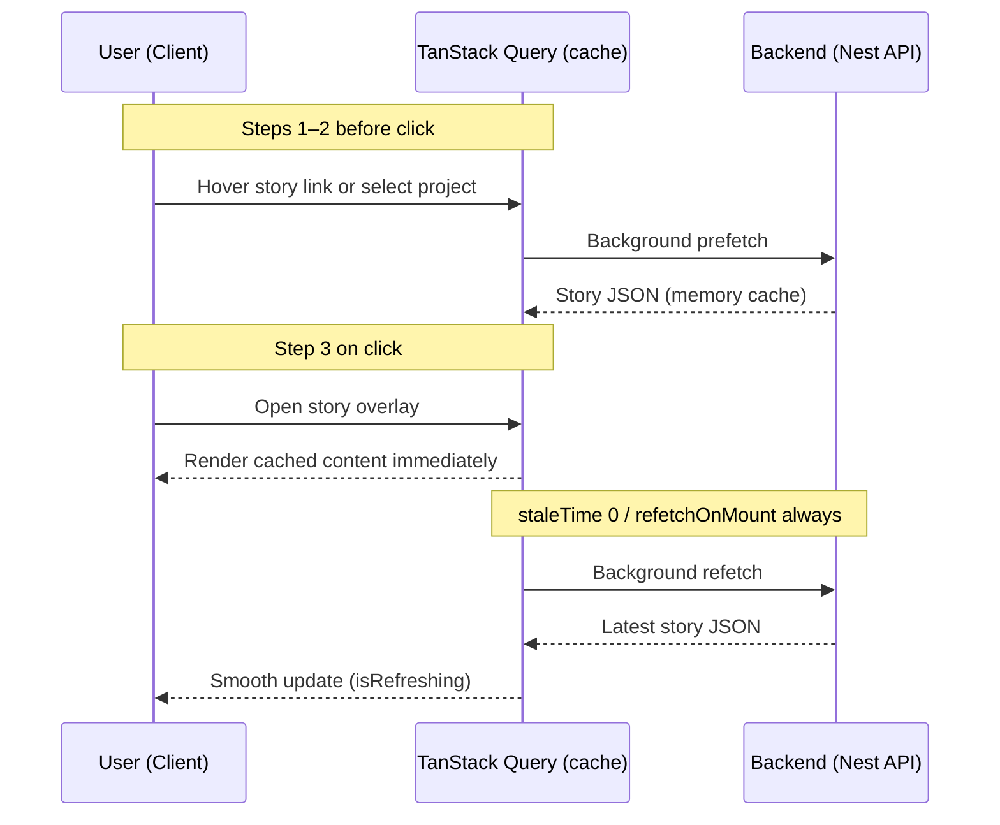

# Portfolio — Joonho Kim

[joonhokim.dev](https://www.joonhokim.dev)

## Preview

### Public site

[<video src="https://github.com/user-attachments/assets/72c4b16e-00e9-48dc-8a56-a7b583ef4bf7" width="100%" autoplay muted loop playsinline />](https://github.com/user-attachments/assets/72c4b16e-00e9-48dc-8a56-a7b583ef4bf7)

_Portfolio demo — hover, project detail, story overlay (MP4)_

### Storybook

Brand / semantic colors (`ThemeColors` story) — same page, light and dark theme.


### Optional showcases

Admin CMS shots are optional — add only if you want to highlight them. Mask or crop any secret URL path in the address bar or page chrome.

## Documentation

<details>
<summary><b>🇰🇷 한국어</b></summary>

Next.js 15 기반 다국어 포트폴리오 및 CMS입니다. **Next.js 15**, **React 19**, **TanStack Query 5**, **Tailwind CSS 4**, **Prisma 7**, **Storybook 10**을 사용합니다.

### 핵심 하이라이트

- **다국어 퍼블릭 사이트** (ko / en / ja): 프로젝트 목록·상세, 3D 아바타, 필터, 드로어
- **상세 스토리**: 어드민 Editor.js 다국어 편집 + 퍼블릭 `?item=&story=1` 오버레이. **TanStack Query** prefetch·stale-while-revalidate
- **RAG 챗봇**: OpenAI + pgvector(Supabase), FAQ·프로젝트 딥링크
- **비공개 CMS**: Supabase Auth, Prisma/PostgreSQL, DnD 정렬, 이미지 업로드, Zod Server Actions
- **프로덕션**: Sentry, GA4/GTM, CI(lint·unit·build), env 시크릿, 챗 API rate limit

### 기술 스택

[](https://nextjs.org/)
[](https://react.dev/)
[](https://www.typescriptlang.org/)
[](https://tailwindcss.com/)
[](https://www.prisma.io/)
[](https://storybook.js.org/)
[](https://tanstack.com/query)

| 계층            | 선택                                                               |
| --------------- | ------------------------------------------------------------------ |
| **Framework**   | Next.js 15 · React 19 · TypeScript 5                               |
| **Styling**     | Tailwind CSS 4 · Framer Motion · next-themes                       |
| **Client data** | TanStack Query 5 — prefetch, deduplication, stale-while-revalidate |
| **i18n**        | next-intl (ko / en / ja)                                           |
| **Data**        | Prisma 7 · PostgreSQL · Supabase (Auth, Storage, pgvector)         |
| **AI / RAG**    | LangChain · OpenAI (`gpt-4o-mini`, `text-embedding-3-small`)       |
| **3D**          | React Three Fiber · drei                                           |
| **Quality**     | Vitest · Playwright · ESLint · GitHub Actions · Storybook 10       |

### 아키텍처

코드베이스는 **책임별 colocation** — `services/` 트리 대신 레이어 소유권에 맞게 배치합니다.

**레이어 역할**

| 레이어        | 역할                                  |
| ------------- | ------------------------------------- |
| `modules/`    | 서버 도메인 — repository → service    |
| `lib/`        | React 없는 순수 헬퍼                  |
| `features/`   | 기능 슬라이스 (admin editor, chatbot) |
| `components/` | 공유 UI                               |
| `hooks/`      | 공유 React 훅                         |
| `app/`        | 라우트, BFF API, server actions       |

**스토리 플로우**: 어드민 Editor.js JSON → BFF `/api/projects/[id]/story` → 퍼블릭 `?item=&story=1` 오버레이



### Technical Decisions & Performance Optimization

기존에는 **「스토리 보기」** 클릭 시점에만 API fetch가 시작되어 cold fetch 지연이 있었습니다. **TanStack Query**로 사용자 흐름(상세 진입 → hover → 클릭)에 맞춘 3단계 prefetch·캐싱을 구축했습니다.

- **Prefetch**: 프로젝트 선택·스토리 링크 hover/focus (`staleTime: 0`, deduplication)
- **즉시 렌더**: 캐시로 오버레이 즉시 표시 (체감 ≈ 0초)
- **백그라운드 동기화**: `refetchOnMount: 'always'`로 어드민 수정 반영



### 기술 결정

- **`modules/projects/`**: repository → service → mapper, Nest API(`API_URL`) 분리
- **`modules/project-detail-page/`**: Editor.js 스토리 도메인, 렌더는 `components/projects/project-story/editor/`
- **`features/chatbot/`**: UI는 feature, 데이터는 `modules/projects`
- **`features/admin/projects/editor/`**: locale 탭(ko/ja/en) i18n 블록
- **Public UI**: `?item=&story=1` 오버레이, TanStack Query (`lib/projects/project-story-query.ts`)
- **Security**: env 시크릿, 미들웨어 세션, `/api/chat` rate limit, HTML sanitization

### 시작하기

```bash
git clone https://github.com/Louis-jk/portfolio.git
cd portfolio
pnpm install
cp .env.example .env.local
pnpm exec prisma migrate deploy
pnpm db:seed
pnpm dev
```

| 명령             | 설명             |
| ---------------- | ---------------- |
| `pnpm dev`       | 개발 서버        |
| `pnpm build`     | 프로덕션 빌드    |
| `pnpm test`      | Vitest           |
| `pnpm test:e2e`  | Playwright       |
| `pnpm storybook` | Storybook (6006) |

**브랜치**: `develop`(통합) → `main`(프로덕션)

</details>

<details>
<summary><b>🇯🇵 日本語</b></summary>

Next.js 15 ベースの多言語ポートフォリオおよび CMS です。**Next.js 15**、**React 19**、**TanStack Query 5**、**Tailwind CSS 4**、**Prisma 7**、**Storybook 10** を使用しています。

### 主なハイライト

- **多言語パブリックサイト** (ko / en / ja): プロジェクト一覧・詳細、3Dアバター、フィルター、ドロワー
- **詳細ストーリー**: 管理画面 Editor.js 多言語編集 + 公開 `?item=&story=1` オーバーレイ。**TanStack Query** プリフェッチ・stale-while-revalidate
- **RAG チャットボット**: OpenAI + pgvector (Supabase)、FAQ・プロジェクトディープリンク
- **非公開 CMS**: Supabase Auth、Prisma/PostgreSQL、DnD 並び替え、画像アップロード、Zod Server Actions
- **プロダクション**: Sentry、GA4/GTM、CI (lint・unit・build)、env シークレット、チャット API レート制限

### 技術スタック

[](https://nextjs.org/)
[](https://react.dev/)
[](https://www.typescriptlang.org/)
[](https://tailwindcss.com/)
[](https://www.prisma.io/)
[](https://storybook.js.org/)
[](https://tanstack.com/query)

| レイヤー        | 選択                                                               |
| --------------- | ------------------------------------------------------------------ |
| **Framework**   | Next.js 15 · React 19 · TypeScript 5                               |
| **Styling**     | Tailwind CSS 4 · Framer Motion · next-themes                       |
| **Client data** | TanStack Query 5 — prefetch、deduplication、stale-while-revalidate |
| **i18n**        | next-intl (ko / en / ja)                                           |
| **Data**        | Prisma 7 · PostgreSQL · Supabase (Auth, Storage, pgvector)         |
| **AI / RAG**    | LangChain · OpenAI (`gpt-4o-mini`, `text-embedding-3-small`)       |
| **3D**          | React Three Fiber · drei                                           |
| **Quality**     | Vitest · Playwright · ESLint · GitHub Actions · Storybook 10       |

### アーキテクチャ

コードベースは **責務別 colocation** — 汎用 `services/` ツリーではなく、レイヤーの所有者に沿って配置します。

**レイヤー役割**

| レイヤー      | 役割                                    |
| ------------- | --------------------------------------- |
| `modules/`    | サーバードメイン — repository → service |
| `lib/`        | React なしの純粋ヘルパー                |
| `features/`   | 機能スライス (admin editor, chatbot)    |
| `components/` | 共有 UI                                 |
| `hooks/`      | 共有 React フック                       |
| `app/`        | ルート、BFF API、server actions         |

**ストーリーフロー**: 管理画面 Editor.js JSON → BFF `/api/projects/[id]/story` → 公開 `?item=&story=1` オーバーレイ


### Technical Decisions & Performance Optimization

従来は **「ストーリーを見る」** クリック時のみ API フェッチが始まり、cold fetch の遅延がありました。**TanStack Query** でユーザー行動（詳細進入 → ホバー → クリック）に合わせた 3 段階プリフェッチ・キャッシュを実装しました。

- **プリフェッチ**: プロジェクト選択・ストーリーリンク hover/focus（`staleTime: 0`、deduplication）
- **即時レンダリング**: キャッシュでオーバーレイ即表示（体感 ≈ 0 秒）
- **バックグラウンド同期**: `refetchOnMount: 'always'` で管理画面の編集を反映



### 設計選択

- **`modules/projects/`**: repository → service → mapper、Nest API (`API_URL`) 分離
- **`modules/project-detail-page/`**: Editor.js ストーリードメイン、レンダラーは `components/projects/project-story/editor/`
- **`features/chatbot/`**: UI は feature、データは `modules/projects`
- **`features/admin/projects/editor/`**: locale タブ (ko/ja/en) i18n ブロック
- **Public UI**: `?item=&story=1` オーバーレイ、TanStack Query (`lib/projects/project-story-query.ts`)
- **セキュリティ**: env シークレット、ミドルウェアセッション、`/api/chat` レート制限、HTML sanitization

### はじめに

```bash
git clone https://github.com/Louis-jk/portfolio.git
cd portfolio
pnpm install
cp .env.example .env.local
pnpm exec prisma migrate deploy
pnpm db:seed
pnpm dev
```

| コマンド         | 説明                 |
| ---------------- | -------------------- |
| `pnpm dev`       | 開発サーバー         |
| `pnpm build`     | プロダクションビルド |
| `pnpm test`      | Vitest               |
| `pnpm test:e2e`  | Playwright           |
| `pnpm storybook` | Storybook (6006)     |

**ブランチ**: `develop`（統合）→ `main`（本番）

</details>

<details>
<summary><b>🇺🇸 English</b></summary>

Multilingual portfolio and CMS built with **Next.js 15 (App Router)**. Stack: **Next.js 15**, **React 19**, **TanStack Query 5**, **Tailwind CSS 4**, **Prisma 7**, **Storybook 10**.

### Highlights

- **Multilingual public site** (ko / en / ja): project list, 3D avatar, filters, detail drawer
- **Rich project stories**: Editor.js admin + public `?item=&story=1` overlay; **TanStack Query** prefetch + stale-while-revalidate
- **RAG chatbot**: OpenAI + pgvector (Supabase), FAQ flows, project deep-links
- **Private admin CMS**: Supabase Auth, Prisma/PostgreSQL, drag-and-drop, image upload, Zod server actions
- **Production-minded**: Sentry, GA4/GTM, CI (lint + unit + build), env secrets, chat API rate limiting

### Tech stack

[](https://nextjs.org/)
[](https://react.dev/)
[](https://www.typescriptlang.org/)
[](https://tailwindcss.com/)
[](https://www.prisma.io/)
[](https://storybook.js.org/)
[](https://tanstack.com/query)

| Layer           | Choices                                                            |
| --------------- | ------------------------------------------------------------------ |
| **Framework**   | Next.js 15 · React 19 · TypeScript 5                               |
| **Styling**     | Tailwind CSS 4 · Framer Motion · next-themes                       |
| **Client data** | TanStack Query 5 — prefetch, deduplication, stale-while-revalidate |
| **i18n**        | next-intl (ko / en / ja)                                           |
| **Data**        | Prisma 7 · PostgreSQL · Supabase (Auth, Storage, pgvector)         |
| **AI / RAG**    | LangChain · OpenAI (`gpt-4o-mini`, `text-embedding-3-small`)       |
| **3D**          | React Three Fiber · drei                                           |
| **Quality**     | Vitest · Playwright · ESLint · GitHub Actions · Storybook 10       |

### Architecture

The codebase favors **colocation by responsibility** — related code lives next to the layer that owns it.

**Layer roles**

| Layer         | Role                                   |
| ------------- | -------------------------------------- |
| `modules/`    | Server domain — repository → service   |
| `lib/`        | Pure helpers (no React)                |
| `features/`   | Feature slices (admin editor, chatbot) |
| `components/` | Shared UI                              |
| `hooks/`      | Shared React hooks                     |
| `app/`        | Routes, BFF API, server actions        |

**Story flow**: Admin Editor.js JSON → BFF `/api/projects/[id]/story` → public `?item=&story=1` overlay


### Technical decisions & performance optimization

Previously, the story API fetch started only on **View story** click (cold fetch). **TanStack Query** adds a three-step prefetch layer (select project → hover link → open overlay):

1. **Prefetch** on selection and hover/focus (`staleTime: 0`, deduplication)
2. **Instant render** from cache when overlay mounts (≈ 0s perceived wait)
3. **Background refetch** (`refetchOnMount: 'always'`) for fresh admin edits



### Design choices

- **`modules/projects/`** — repository → service → mapper; Nest via `API_URL`
- **`modules/project-detail-page/`** — Editor.js story domain; render in `components/projects/project-story/editor/`
- **`features/chatbot/`** — UI in feature; data from `modules/projects`
- **`features/admin/projects/editor/`** — per-locale (ko/ja/en) i18n blocks
- **Public UI** — `?item=&story=1` overlay; TanStack Query in `lib/projects/project-story-query.ts`
- **Security** — env secrets, middleware sessions, `/api/chat` rate limit, HTML sanitization

### Getting started

```bash
git clone https://github.com/Louis-jk/portfolio.git
cd portfolio
pnpm install
cp .env.example .env.local
pnpm exec prisma migrate deploy
pnpm db:seed
pnpm dev
```

| Command          | Description           |
| ---------------- | --------------------- |
| `pnpm dev`       | Development server    |
| `pnpm build`     | Production build      |
| `pnpm test`      | Vitest unit tests     |
| `pnpm test:e2e`  | Playwright            |
| `pnpm storybook` | Storybook (port 6006) |

**Branches**: `develop` (integration) → `main` (production)

</details>

## Reference

Language-neutral technical reference (paths, hooks, env).

### Directory tree (selected)

```text
src/
├── app/
│   ├── [locale]/                    # Public pages + admin routes
│   │   └── (private)/[adminPath]/projects/[id]/detail/
│   └── api/projects/[id]/
│       ├── detail-page/             # BFF — auth CRUD → Nest
│       └── story/                   # BFF — public read
├── modules/
│   ├── projects/
│   └── project-detail-page/
├── features/
│   ├── chatbot/
│   └── admin/projects/editor/
├── lib/
│   ├── http/
│   ├── project-detail-page/
│   ├── projects/
│   ├── query/                       # TanStack Query provider
│   └── rag/
├── components/projects/
│   ├── project-list/
│   ├── project-detail/
│   └── project-story/
└── hooks/
```

### Shared hooks (`src/hooks/`)

| Hook                         | Role                                      |
| ---------------------------- | ----------------------------------------- |
| `useBreakpoints`             | Detail panel — mobile / tablet / desktop  |
| `useLayoutBreakpoints`       | Home shell — mobile / 2-col / desktop     |
| `useProjectSelection`        | URL `?item=`, drawer, analytics           |
| `useProjectStory`            | URL `?story=1` overlay                    |
| `usePrefetchProjectStory`    | Prefetch story on hover, focus, selection |
| `useProjectListInteractions` | Keyboard nav, Lenis scroll, hover preview |

### Environment variables

Copy `.env.example` → `.env.local`. Never commit secrets.

**Required:** `DATABASE_URL`, `DIRECT_URL`, Supabase URL/keys, `OPENAI_API_KEY`, `NEXT_PUBLIC_ADMIN_SECRET_PATH`

**Optional:** `API_URL` — Nest API base URL

### Testing & CI

```bash
pnpm test          # Vitest
pnpm test:e2e      # Playwright
```

CI runs lint, unit-test, and build on push/PR.

## License

Private portfolio project — code public for review; assets and copy © Joonho Kim.
